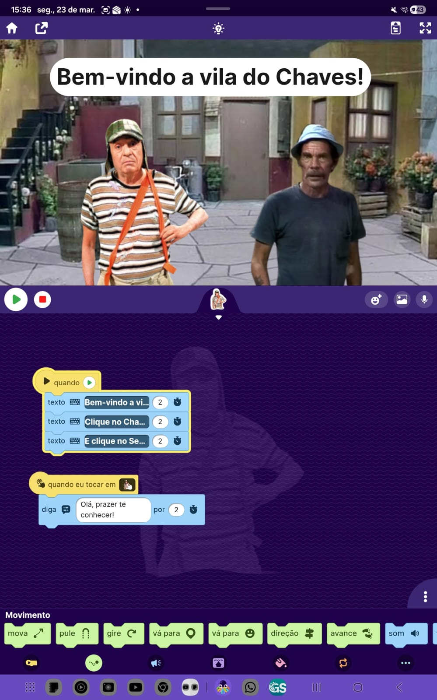
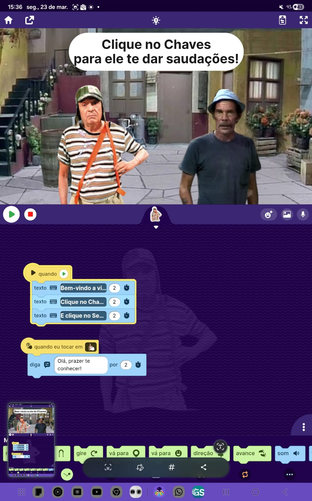
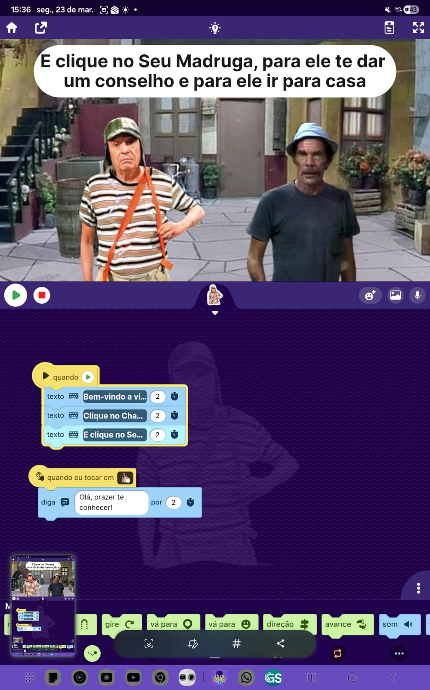
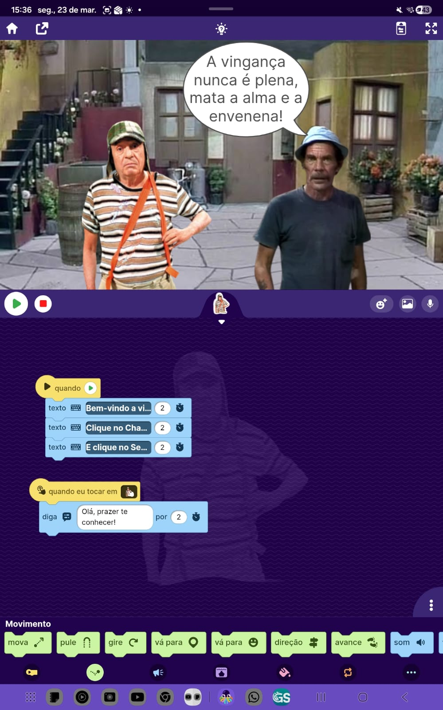
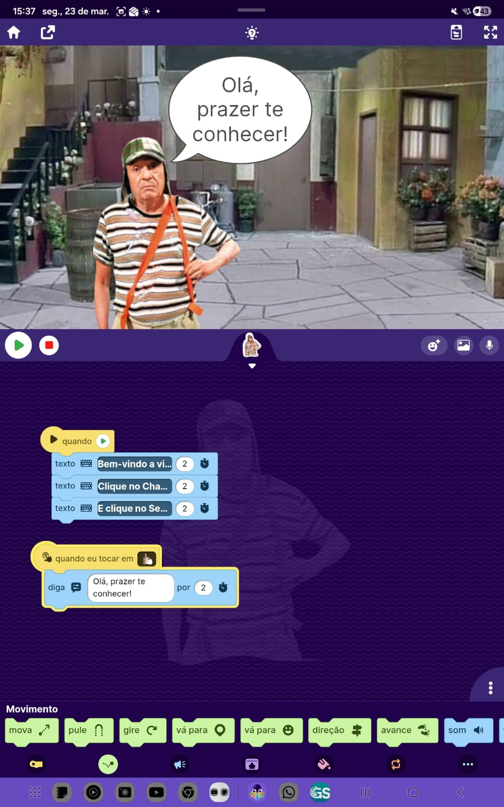

# Simulador no OctoStudio

## Descrição
Este projeto foi desenvolvido no OctoStudio como parte da disciplina APC.

## O que o programa faz
O programa simula um comportamento interativo utilizando variáveis e condições.

## Como usar
- Execute o projeto no OctoStudio
- Interaja com as entradas solicitadas

## Prints

## O que aprendi
Aprendi como utilizar variáveis, entrada de dados e lógica condicional para criar um algoritmo.

